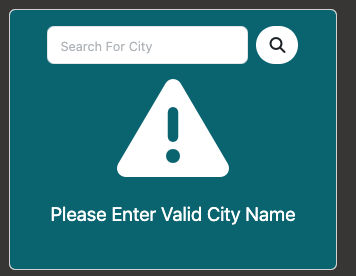

# Weather App 1.0
This weather app project is front-end only. It was done to learn how to work with third party api openweathermap,bootstrap fundamentals,scss fundamentals,npm,fontawesome icons,and the bundler Parcel.

The weather app allows user to search for current temperature of any city/country provided by the openweathermap api. 

If query is successful the software will display an icon representing the weather(example : sunny,rain,cloudy,snow), the current temperature in celsius, the city/country name, the weather condition(clouds,snow,clear,rain), the humidity in percentage,and the wind speed in km/h. 

If query is unsuccessful an error icon and message will display.

The version of the api used is the free tier therefore weather may not be real time.

## Instructions
1. Clone the repository
2. run the 'npm init -y' command in root directory of project
3. to install Parcel run 'npm i --save-dev parcel'
4. to install BootStrap run 'npm i --save bootstrap @popperjs/core'
5. to configure Parcel add the following to the scripts object in package.json: ' "start": "parcel serve src/index.html --public-url / --dist-dir dist"' 
6. to start Parcel run the following command in the root directory of project:'npm start'

For a more detailed explanation of steps 2-6: https://getbootstrap.com/docs/5.3/getting-started/parcel/

## Usage
### API Key Setup
1. Obtain a free API Key from https://openweathermap.org/api.
2. Need to create a config.js file in js directory as I did not include in repository.
3. Add the following line to config.js: 'export const apiKey = "Your Api Key";'

I did the following to avoid hardcoding the key value in main.js file.

## Demo
Check out the live demo of the project at: https://cityweatherapp1.netlify.app/
